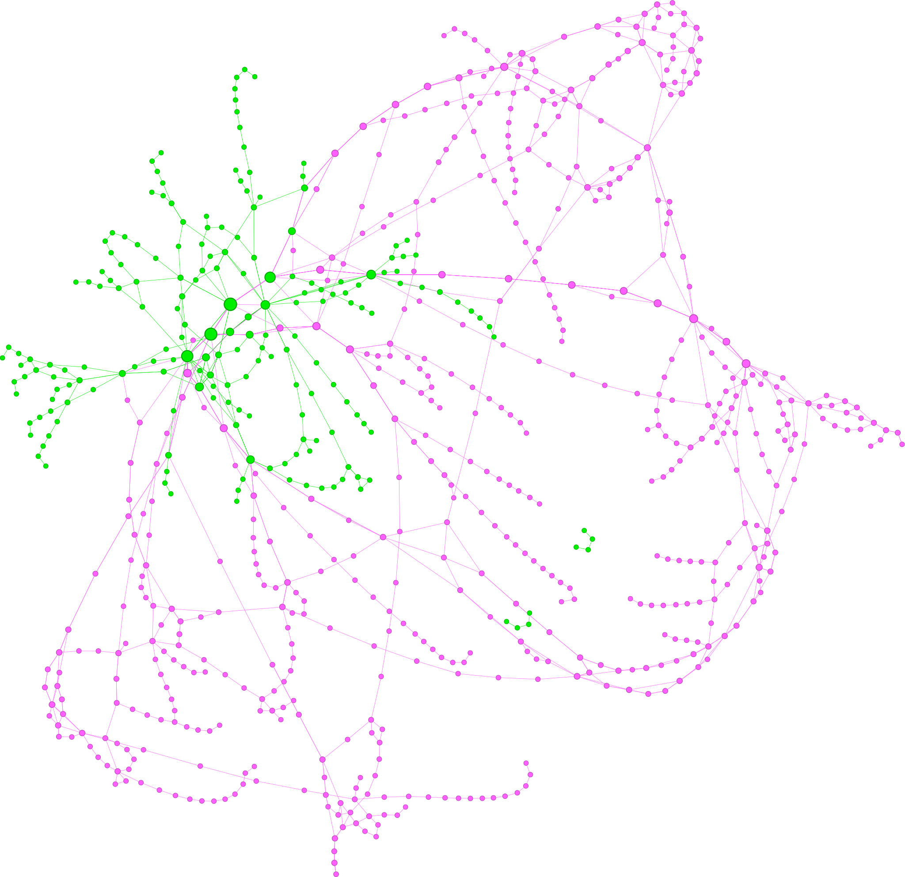
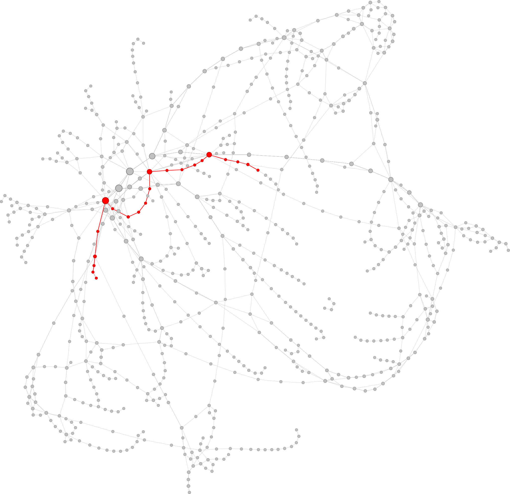

```{r, include = FALSE}
set.seed(42)
```

```{r, include = FALSE}
library(dplyr)
library(ggplot2)
library(igraph)
library(ggrepel)
library(intergraph)
library(ergm)
library(ergm.count)
library(pscl)
```


```{r, echo=FALSE, out.width='100%'}

```

```{r, echo=FALSE, out.width='100%'}

```

## 1. Exploratory Data Analysis
```{r}
# Data import
tab <- read.csv("../data/clean/edge_list.csv")
tab[,2] <- trimws(tab[,2], which = "left")

tab <- tab %>% 
  mutate(urbanedge = ifelse(startsWith(Source, "padova") & startsWith(Target, "padova"), 1, 0))

g <- graph_from_data_frame(tab[, 1:2], directed = FALSE)
E(g)$label <- tab[, 3] # labelling edges

# urban stop
urban.stop <- ifelse(startsWith(V(g)$name, "padova"), 1, 0)
V(g)$label <- urban.stop # labelling vertices

# Conversione multigrafo in grafo pesato ----------------------------------

E(g)$weight <- 1
g.pesato <- igraph::simplify(g,
                             edge.attr.comb = list(weight = sum))
```

```{r, echo = FALSE}
deg <- degree(g)

ggplot() +
  aes(deg) +
  geom_histogram(fill = "light blue", col = "black", binwidth = 1) + 
  ggtitle("Istogramma dei gradi dei nodi") +
  xlab("Grado") +
  ylab("Frequenza") +
  theme_bw()
```

```{r, echo = FALSE}
freq <- table(degree(g))

ggplot() +
  aes(x = log(sort(unique(deg))), 
      y = as.vector(log(freq))) +
  geom_point(colour = "black") +
  ggtitle("Log-log plot dei gradi") +
  xlab("Logaritmo del grado") +
  ylab("Log-frequenza") +
  theme_bw()
```

```{r, echo = FALSE}
grado.vicini <- knn(g.pesato,
                  mode = "all",
                  weights = E(g.pesato)$weight)

ggplot() +
  aes(x = degree(g.pesato), y = grado.vicini$knn) +
  geom_point(shape = 1) +
  ggtitle("Rapporto tra grado del nodo e grado dei suoi vicni") +
  xlab("Grado del nodo") +
  ylab("Grado dei vicini") +
  theme_bw()

ggplot() +
  aes(x = degree(g.pesato), y = log(grado.vicini$knn)) +
  geom_point(shape = 1) +
  ggtitle("Rapporto tra log-grado del nodo e log-grado dei suoi vicni") +
  xlab("Logaritmo del grado del nodo") +
  ylab("Logaritmo del grado dei vicini") +
  theme_bw()
```


```{r, echo = FALSE}
bet <- betweenness(g)
head(sort(log(bet), decreasing = TRUE))

ggplot() +
  aes(bet) +
  geom_histogram(fill = "light blue", col = "black") +
  ggtitle("Istogramma della betweenness dei nodi") +
  xlab("Betweenness") +
  ylab("Frequenza") +
  theme_bw()

ggplot() +
  aes(x = bet, y = degree(g)) +
  geom_point(shape = 1, colour = "black") +
  ggtitle("Rapporto tra grado e betweenness dei nodi") +
  xlab("Betweenness") +
  ylab("Geado") +
  theme_bw()

ggplot() +
  aes(x = bet, y = degree(g), label = V(g)$name) +
  geom_point() +
  geom_label_repel() +
  ggtitle("Rapporto tra grado e betweenness dei nodi") +
  xlab("Betweenness") +
  ylab("Geado") +
  theme_bw()

```

```{r}
# Closeness centrality dei vertici
cl <- sort(closeness(g), decreasing = TRUE)
head(cl)
```

```{r}
# Coefficienti di assortatività
modularity(g, 
           membership = urban.stop + 1,
           directed = FALSE)

assortativity_nominal(g,
                      urban.stop + 1,
                      directed = FALSE)

assortativity_degree(g, directed = FALSE)
```


```{r}
# Diametro
diameter(g, directed = FALSE)

# Lunghezza media
mean_distance(g)
log(length(V(g)))

# Transitività
transitivity(g)
```

## 2. Modelling

Remove and reading data again to avoid conflicts
```{r}
rm(list=ls())

tab <- read.csv("../data/clean/edge_list.csv")
tab[,2] <- trimws(tab[,2], which = "left")

g <- graph_from_data_frame(tab[, 1:2], directed = FALSE)

# urban stop
urban.stop <- ifelse(startsWith(V(g)$name, "padova"), 1, 0)

# creazione del grafo con archi pesati
E(g)$weight <- 1
g.pesato <- igraph::simplify(g, edge.attr.comb = list(weight = sum))
weighted.df <- get.data.frame(g.pesato)
weighted.df <- weighted.df %>% 
  mutate(urbanedge = ifelse(startsWith(from, "padova") & startsWith(to, "padova"), 1, 0))

E(g.pesato)$urbanedge <- weighted.df[, 4]
# Adding attributes to network --------------------------------------------

# conversione da ogetto igraph a intergraph
g.pesato.interg <- intergraph::asNetwork(g.pesato)

# setting vertex attributes
g.pesato.interg %v% "urbano" <- urban.stop

# setting edge attributes
set.edge.attribute(g.pesato.interg, "urbanedge", weighted.df[, 4])

pesi <- E(g.pesato)$weight
```


```{r, include = FALSE}
# somma dei gradi dei nodi incidenti ad un arco
sum_degrees_of_incident_nodes <- function(graph) {
  # Get the number of edges in the graph
  num_edges <- ecount(graph)
  
  # Initialize an empty vector to store the sum of degrees for each edge
  sum_degrees <- numeric(num_edges)
  
  # Iterate over each edge
  for (i in 1:num_edges) {
    # Get the endpoints of the current edge
    endpoints <- ends(graph, i)
    
    # Get the degrees of the incident nodes
    degree_1 <- degree(graph, v = endpoints[1])
    degree_2 <- degree(graph, v = endpoints[2])
    
    # Calculate the sum of the degrees of the incident nodes
    sum_degrees[i] <- degree_1 + degree_2
  }
  
  # Return the vector containing the sum of degrees for each edge
  return(sum_degrees)
}

# somma della closeness centrality dei nodi incidenti ad un arco
sum_centrality_of_adjacent_nodes <- function(graph) {
  # Get the number of edges in the graph
  num_edges <- ecount(graph)
  
  # Initialize an empty vector to store the sum of centrality indices for each edge
  sum_centrality <- numeric(num_edges)
  
  # Compute the centrality indices for all nodes
  centrality_values <- closeness(graph)
  
  # Iterate over each edge
  for (i in 1:num_edges) {
    # Get the endpoints of the current edge
    endpoints <- ends(graph, i)
    
    # Get the centrality indices of the adjacent nodes
    centrality_1 <- centrality_values[endpoints[1]]
    centrality_2 <- centrality_values[endpoints[2]]
    
    # Calculate the sum of the centrality indices of adjacent nodes
    sum_centrality[i] <- centrality_1 + centrality_2
  }
  
  # Return the vector containing the sum of centrality indices for each edge
  return(sum_centrality)
}

# somma della betweenness dei nodi incidenti ad un arco
sum_betweenness_of_adjacent_nodes <- function(graph) {
  # Get the number of edges in the graph
  num_edges <- ecount(graph)
  
  # Initialize an empty vector to store the sum of betweenness centralities for each edge
  sum_betweenness <- numeric(num_edges)
  
  # Compute the betweenness centrality for all nodes
  betweenness_values <- betweenness(graph)
  
  # Iterate over each edge
  for (i in 1:num_edges) {
    # Get the endpoints of the current edge
    endpoints <- ends(graph, i)
    
    # Get the betweenness centralities of the adjacent nodes
    centrality_1 <- betweenness_values[endpoints[1]]
    centrality_2 <- betweenness_values[endpoints[2]]
    
    # Calculate the sum of the betweenness centralities of adjacent nodes
    sum_betweenness[i] <- centrality_1 + centrality_2
  }
  
  # Return the vector containing the sum of betweenness centralities for each edge
  return(sum_betweenness)
}

# somma dei pesi dei nodi incidenti ad un arco
sum_weights_of_incident_edges <- function(graph) {
  # Get the number of edges in the graph
  num_edges <- ecount(graph)
  
  # Initialize an empty vector to store the sum of weights for each edge
  sum_weights <- numeric(num_edges)
  
  # Iterate over each edge
  for (i in 1:num_edges) {
    # Get the endpoints of the current edge
    endpoints <- ends(graph, i)
    
    # Get the incident edges for the first endpoint
    incident_edges_1 <- incident(graph, endpoints[1], mode = "all")
    # Exclude the current edge from the incident edges
    incident_edges_1 <- setdiff(incident_edges_1, i)
    
    # Get the incident edges for the second endpoint
    incident_edges_2 <- incident(graph, endpoints[2], mode = "all")
    # Exclude the current edge from the incident edges
    incident_edges_2 <- setdiff(incident_edges_2, i)
    
    # Sum the weights of the incident edges for each endpoint
    sum_weights[i] <- sum(E(graph)[incident_edges_1]$weight) + sum(E(graph)[incident_edges_2]$weight)
  }
  
  # Return the vector containing the sum of weights for each edge
  return(sum_weights)
}

# variabile categoriale che indica quanti dei due nodi incidenti ad un arco sono hub
# hubs: vettore di hub da passare come argomento
edge_in_hubs <- function(graph, hubs) {
  # Get the number of edges in the graph
  num_edges <- ecount(graph)
  
  # Initialize a numeric vector to store the result for each edge
  edge_in_hub <- numeric(num_edges)
  
  # Iterate over each edge
  for (i in 1:num_edges) {
    # Get the endpoints of the current edge
    endpoints <- ends(graph, i)
    
    # Check if both endpoints are in the 'hubs' vector
    if (endpoints[1] %in% hubs && endpoints[2] %in% hubs) {
      edge_in_hub[i] <- 2  # Both endpoints are in 'hubs'
    } else if (endpoints[1] %in% hubs || endpoints[2] %in% hubs) {
      edge_in_hub[i] <- 1  # One endpoint is in 'hubs'
    } else {
      edge_in_hub[i] <- 0  # Neither endpoint is in 'hubs'
    }
  }
  
  # Return the numeric vector indicating if each edge has one or both endpoints in 'hubs'
  return(edge_in_hub)
}
```

### 2.1 Binary models
```{r, echo = FALSE}
control <- control.ergm(MCMLE.maxit = 1000,MCMLE.density.guard = 30)
control2 <- control.ergm(MCMLE.maxit = 1000,MCMLE.density.guard = 30,
                         main.method = "MCMLE", force.main = TRUE)
```

```{r}
mod1 <- ergm(g.pesato.interg ~ edges)
summary(mod1)

# dalla stima, ricaviamo una probabilita' di un arco tra due nodi
plogis(mod1$coefficients)
# probabilità molto bassa
igraph::edge_density(g.pesato)
```

```{r}
# modello di erdo-renyi usando la presenza o meno di un nodo nella citta'
# di padova come covariata binaria
mod2 <- ergm(g.pesato.interg ~ edges + nodefactor("urbano"))
summary(mod2)
#' La variabile relativa alla presenza o meno del nodo nella citta' di 
#' padova non sembra essere significativo.
# rapporto di quote vale 1.058
```

```{r}
mod4 <- ergm(g.pesato.interg ~ edges + nodematch("urbano"))
summary(mod4)
```

```{r}
mod.stelle <- ergm(g.pesato.interg ~ kstar(1:2) + nodematch("urbano"))
summary(mod.stelle)
```

```{r}
mod.stelle.alt <- ergm(g.pesato.interg ~ altkstar(lambda = 1, fixed = TRUE) + nodematch("urbano"))
summary(mod.stelle.alt)
```

### 2.2 Modelling including edge weights
```{r, echo = FALSE}
ggplot() +
  aes(pesi) +
  geom_histogram(fill = "light blue", col = "black", binwidth = 1) + 
  ggtitle("Istogramma dei pesi degli archi") +
  xlab("Peso") +
  ylab("Frequenza") +
  theme_bw()
```

```{r}
mod7 <- ergm(g.pesato.interg ~ sum,
             response = "weight", reference = ~Poisson)
summary(mod7)

```

```{r}
mod8 <- ergm(g.pesato.interg ~ sum + nodematch("urbano"),
             response = "weight", reference = ~Poisson)
summary(mod8)
```

```{r}
mod9 <- ergm(g.pesato.interg ~ sum +
               edges + 
               nodematch("urbano"),
             response = "weight", reference = ~Poisson)
summary(mod9)
```

### 2.3 Modelling just edge weights 

We model edge weights minus 1 as a sample coming from a Zero-Inflated Poisson

```{r}
# hubs defined
hubs <- c("padova autostazione",
          "padova piazzale boschetti",
          "padova stazione fs",
          "padova bassanello",
          "padova prato della valle",
          "padova ospedale",
          "monselice autostazione")

# code used to define the functions available in modelling.R file
somma.pesi <- sum_weights_of_incident_edges(g.pesato)
somma.centralita <- sum_centrality_of_adjacent_nodes(g.pesato)
somma.gradi <- sum_degrees_of_incident_nodes(g.pesato)
somma.bet <- sum_betweenness_of_adjacent_nodes(g.pesato)
in.hub <- as.factor(edge_in_hubs(g.pesato, hubs))
```

```{r}
zero.inf.mod <- zeroinfl(I(pesi - 1) ~ E(g.pesato)$urbanedge + log(somma.bet + 1) + somma.pesi + in.hub |  1,
                     dist = "poisson")

co <- coef(zero.inf.mod)
X <- model.matrix(zero.inf.mod)
p <- NCOL(X)
# vettore dei valori attesi
mu.hat <- as.vector(exp(X %*% co[1:6]))
cphi.hat <- plogis(co[p+1]) # 1 - phi cappello
phi.hat <- 1 - cphi.hat # phi_i stimati

zip.exp <- sapply(0:20, function(n) {
  if (n == 0) {
    mean(cphi.hat) + mean(phi.hat * dpois(n, mu.hat))
  }
  else {
    mean(phi.hat * dpois(n, mu.hat))
  }
})
table(pesi - 1)
pesi.complete <- c(751, 119, 34, 17, 6, 4, 6, 7, 2, 1, 1, 0, 1, 0, 0, 0, 0, 1, 0, 0, 1)

mat <- cbind(pesi.complete, 951* round(zip.exp, 2))
rownames(mat) <- 1:21
colnames(mat) <- c("pesi", "stime")

mat
```

